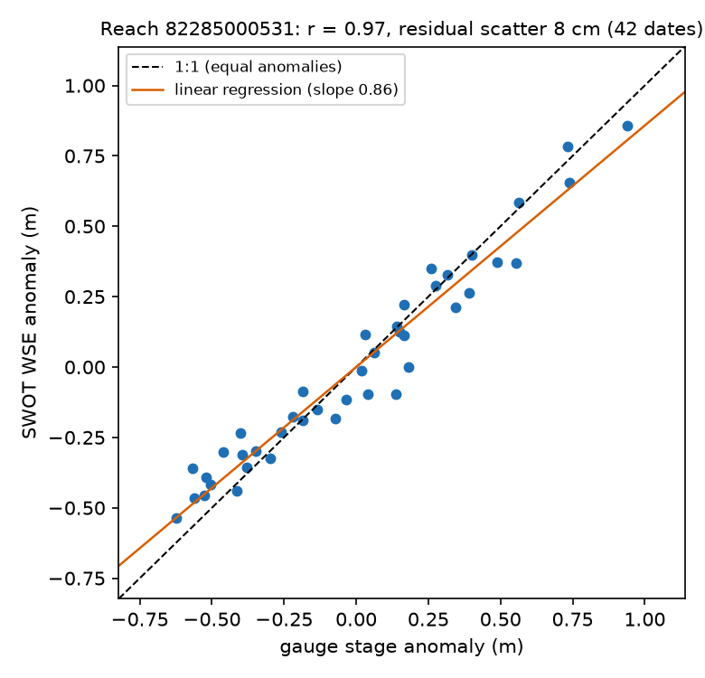
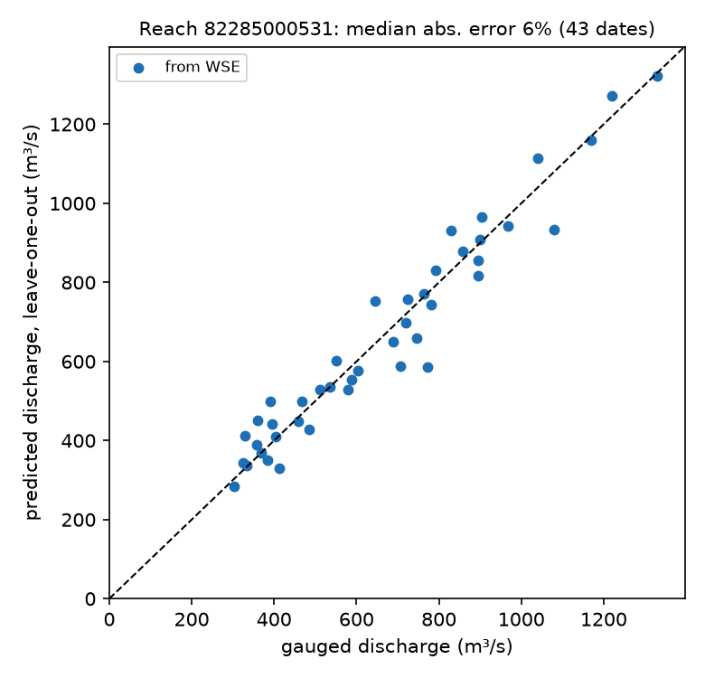
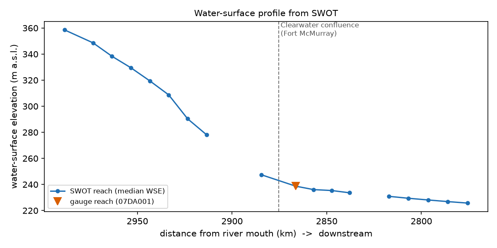
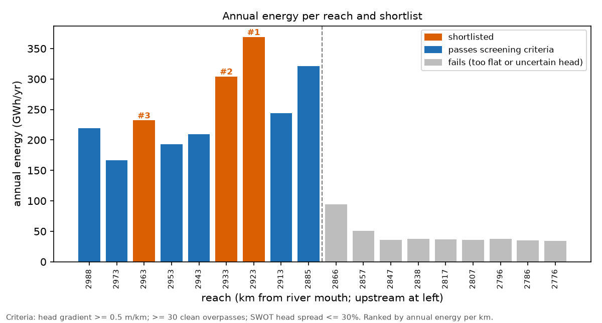

# river-power

Hydropower screening from SWOT satellite observations, validated on the Athabasca River
at Fort McMurray, Alberta, against Water Survey of Canada gauge 07DA001.

Two-page summary: [report/summary.pdf](report/summary.pdf)

## Motivation

The gross hydropower potential of a river reach is P = ρgQHη, where Q is discharge, H is
hydraulic head and η is efficiency. Screening a river therefore requires discharge and head
along its length, plus mean velocity to characterise the flow regime. These are normally
obtained from gauges and field surveys, which cover only a small fraction of rivers.

SWOT (Surface Water and Ocean Topography; NASA and CNES, with the Canadian Space Agency and
the UK Space Agency; launched December 2022) measures water-surface elevation (WSE), width
and slope for rivers wider than about 100 m, reported per SWORD reach (about 10 km). This
project addresses two questions:

1. How accurately does SWOT observe this river, judged against an independent gauge?
2. Can SWOT observations alone locate the head and estimate the hydropower potential along
   about 200 km of river?

## Results

<!-- results:start (filled in by report/make_summary.py from outputs/; edits here are overwritten) -->
This section is generated from `outputs/` by `report/make_summary.py`. The full write-up is in [report/summary.pdf](report/summary.pdf).

### 1. Does SWOT measure the river accurately?

A rating curve fitted to SWOT water-surface elevation predicted gauged discharge with a median error of **5-6%** under leave-one-out cross-validation at two independent reaches. SWOT width showed no usable relationship with discharge.

|  | Gauge reach | Reach 40 km downstream |
|---|---|---|
| SWOT observations matched to gauge days | 43 | 36 |
| WSE vs gauge stage anomaly: correlation / scatter | 0.97 / 8 cm | 0.99 / 11 cm |
| Discharge error, leave-one-out (median) | 6.1% | 4.8% |
| Discharge error, latest 30% of dates (median) | 5.2% | 5.1% |
| Width vs discharge: correlation | 0.03 | 0.21 |

 

*Left: SWOT WSE anomaly vs gauge stage anomaly. Right: discharge predicted from SWOT WSE (leave-one-out) vs gauged discharge.*

Quality control: 6,612 observations, 1,299 retained. **Version consistency.** SWOT product version D (SWORD v17b) reuses some reach IDs for different locations, giving WSE differences of 13&ndash;20 m for the same pass. After matching reaches by coordinates, all 19 agree within 9 cm.

### 2. Where is the hydropower potential?

**SWOT-only discharge:** using SWOT for both discharge and head, the design flow (discharge exceeded 30% of the time) is within 2% of the gauged value at the gauge reach, and a median 3% across 8 reaches upstream. Accuracy decreases near the Clearwater confluence: 22% and 12% median error at the two nearest reaches, compared with 7&ndash;9% further upstream.

**Head:** about 106 m in the 9 reaches of rapids above Fort McMurray. Two independent SWOT estimates of head agree within 0.5%.



**Mean velocity** at the design flow: 1.1&ndash;1.6 m/s in the rapids and 0.6&ndash;0.8 m/s below Fort McMurray (Manning's equation).

**Screening:** 9 of 18 reaches meet the criteria (head gradient &ge; 0.5 m/km, &ge; 30 valid observations, consistent SWOT head). Shortlist, ranked by annual energy per km:

| Rank | Reach (km from mouth) | Head | Head gradient | Capacity | Annual energy | Capacity factor | Mean velocity |
|---|---|---|---|---|---|---|---|
| #1 | 82287000041 (2923 km) | 17.4 m | 1.74 m/km | 87 MW | 369 GWh/yr | 0.48 | 1.6 m/s |
| #2 | 82287000051 (2933 km) | 14.3 m | 1.44 m/km | 72 MW | 304 GWh/yr | 0.48 | 1.5 m/s |
| #3 | 82287000081 (2963 km) | 10.9 m | 1.10 m/km | 55 MW | 232 GWh/yr | 0.48 | 1.3 m/s |



*Annual energy per reach. Orange: shortlisted; blue: meets the criteria; grey: insufficient head gradient or measurement confidence.*

All values are gross theoretical potential for screening, not plant designs (see Limitations).
<!-- results:end -->

## Method

The scripts in `scripts/` run in numerical order.

1. **Gauge data** (`10`). Daily discharge and stage for 07DA001 (Athabasca River below Fort
   McMurray) and 07CD001 (Clearwater River, the tributary that joins at Fort McMurray) from
   the ECCC HYDAT API, 1957 onward, with provisional real-time data for 2026.
2. **SWOT data** (`11`, `11b`). All River Single Pass reach observations for 19 reaches from
   NASA's Hydrocron API, product versions C and D. Reaches renumbered in version D are
   mapped to their version C IDs by location.
3. **Quality control** (`12`, `13b`). Removal of fill values, ice-affected months, flagged,
   partially observed and dark-water observations, WSE outliers (median absolute deviation
   test), and passes duplicated across versions; version C/D consistency check.
4. **Validation** (`13`). SWOT WSE anomalies compared with gauge stage anomalies. A rating
   curve Q = a(h − h0)^b is fitted to SWOT WSE and gauged discharge and evaluated by
   leave-one-out cross-validation and a chronological 70/30 split. Width is tested as an
   alternative predictor. Repeated at a second reach 40 km downstream.
5. **Head and power** (`14`). Head per reach H = S × L from SWOT slope and reach length,
   cross-checked against WSE differences between adjacent reaches. Gross potential
   P = ρgQHη at the design flow Q30 (discharge exceeded 30% of the time).
6. **Screening** (`15`). Design flow from SWOT alone; mean velocity from Manning's equation
   (wide-channel approximation, n = 0.025–0.045); annual energy and capacity factor from the
   daily discharge record with a 10% environmental flow; reaches that meet the screening
   criteria ranked by annual energy per km.
7. **Summary** (`report/make_summary.py`). Builds the PDF and the Results section above from
   `outputs/`.

## Data issues identified

- **Reach ID reuse between SWOT product versions.** In version D (SWORD v17b), some reach
  IDs refer to a different location than in version C (SWORD v16), producing WSE
  differences of 13–20 m for the same pass. I detected this by comparing the two versions
  on shared passes and resolved it by matching reaches on coordinates (`11b`, `13b`).
- **Width is not a usable discharge predictor on this river.** SWOT width showed no usable
  correlation with discharge at either validation reach, so the method relies on WSE.
- **Unconstrained rating-curve fits.** Without bounds, the exponent converged to b = 20.7 at
  one reach, so b is constrained to 0.8–5.
- **Reduced accuracy near the Clearwater confluence.** SWOT-derived discharge has larger
  errors at the two reaches nearest the confluence. Backwater from the Clearwater is a
  plausible cause, but a test correlating rating error with the Clearwater's share of
  discharge was inconclusive.

## Limitations

- Gross theoretical potential for screening only: no costs, access, ice, fish passage or
  land-use constraints.
- The rating curve requires calibration against a gauge; ungauged rivers would need another
  way to constrain it.
- Velocity depends on an assumed roughness coefficient; no velocity measurements were used.
- Head is assumed independent of discharge, and SWOT observations are limited to the
  open-water season (May–October).
- Two reaches are missing from the profile, so total head is understated.

## Reproducing the results

Requires Python 3.10+. No accounts are needed for the data (a few MB in total).

```bash
python3 -m venv .venv && source .venv/bin/activate
pip install -r requirements.txt

python3 tests/test_swot_pipeline.py        # end-to-end test on synthetic data

python3 scripts/10_fetch_gauge.py          # gauge discharge and stage
python3 scripts/11_fetch_swot.py           # SWOT reach observations, versions C and D
python3 scripts/11b_find_version_d_ids.py  # map renumbered reaches by location
python3 scripts/13b_version_check.py       # version C/D consistency check
python3 scripts/12_clean_swot.py           # quality control
python3 scripts/13_validate.py             # validation at the gauge reach
python3 scripts/13_validate.py --reach 82285000481   # independent reach, 40 km downstream
python3 scripts/14_power.py                # head profile and gross potential
python3 scripts/15_screening.py            # SWOT-only discharge, velocity, energy, shortlist
python3 report/make_summary.py             # summary PDF and Results section
```

Reach IDs and settings are in `swot_config.yaml`. The IDs were identified with
`scripts/gee_find_reaches.js` in the Google Earth Engine Code Editor, using the SWORD
database.

`data/` is not tracked; the fetch scripts recreate it. `outputs/` and `figures/` contain the
results shown above. `tests/test_swot_pipeline.py` runs every script on synthetic data with
known answers and mocked API responses.

## Repository structure

| Path | Contents |
|---|---|
| `scripts/10_` to `15_` | processing steps, run in order |
| `swot_config.yaml` | gauges, reach IDs, quality thresholds, power settings |
| `outputs/`, `figures/` | result tables and figures |
| `report/` | summary PDF and the script that builds it |
| `tests/` | synthetic end-to-end and unit tests |
| `docs/`, `riverlib/`, `scripts/01_` to `03_`, `config.yaml` | earlier width-based method (below) |

## Earlier approach

The project began on the Yubetsu River in Hokkaido, where I worked on a farm over the summer,
using channel width from Sentinel-2 and Sentinel-1 imagery to estimate discharge. Synthetic
tests showed that at 10 m resolution the method requires a low-flow width of at least about
45 m, which the Yubetsu does not meet, so I moved to SWOT on a larger river. See
[docs/sentinel-width-method.md](docs/sentinel-width-method.md).

## Data sources

- SWOT River Single Pass product (NASA/CNES), via [PO.DAAC Hydrocron](https://podaac.github.io/hydrocron/)
- SWORD river reach database (Altenau et al., 2021), via the Earth Engine community catalog
- Water Survey of Canada HYDAT and real-time data, Environment and Climate Change Canada

Code is released under the MIT License (see `LICENSE`). Data remain the property of their
providers.
